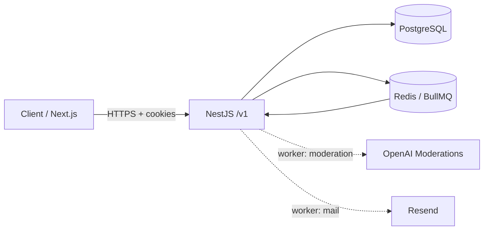
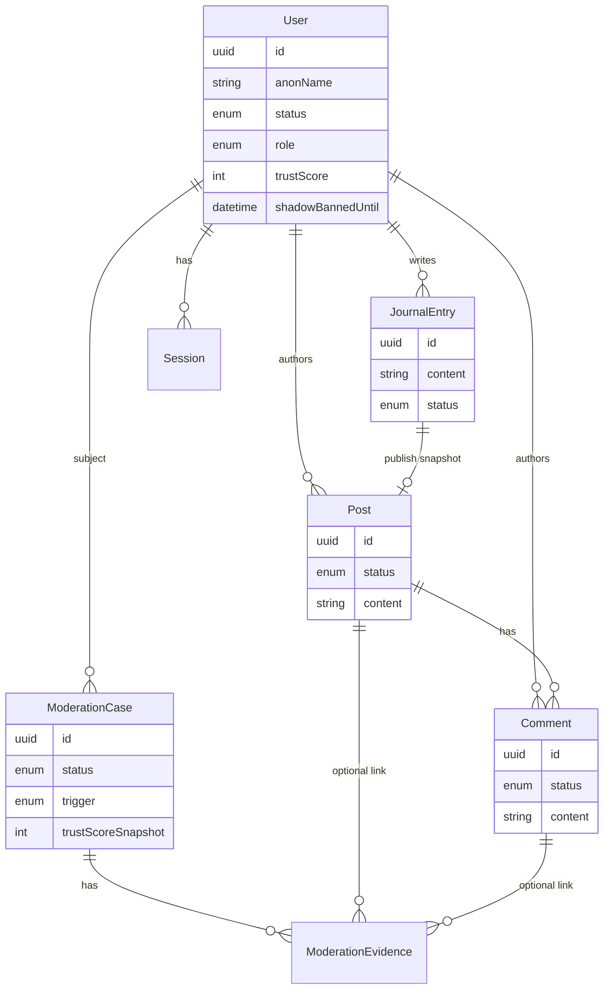
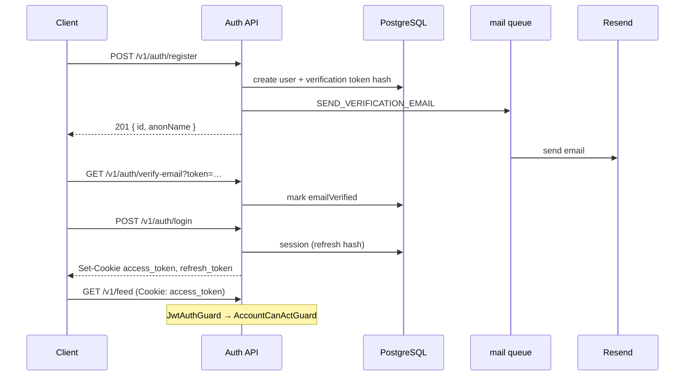
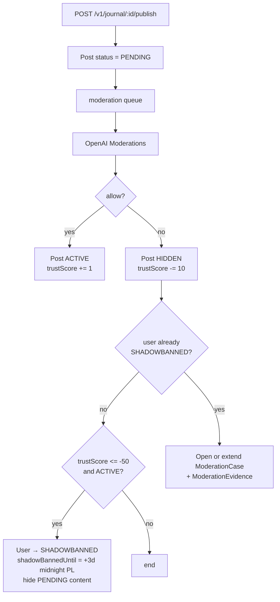

# Mental Journal — Technical Context

Privacy-first anonymous emotional support platform. Backend is the source of truth; frontend consumes REST only.

This file describes **what is implemented today** (API v1). Product vision leftovers (chat, CMS UI) are listed under Out of scope.

---

## Stack

| Layer | Choice |
|--------|--------|
| Monorepo | pnpm + Turborepo |
| API | NestJS (`apps/api`), prefix `/v1` |
| DB | PostgreSQL 16 + Prisma 7 |
| Queue | Redis 7 + BullMQ |
| Auth | JWT access + refresh in **httpOnly** cookies |
| Mail | Resend (async via `mail` queue) |
| Moderation | OpenAI Moderations API (async via `moderation` queue) |
| Frontend | Next.js (`apps/web`, port 3000) |

Local infra: `docker/docker-compose.yml` (Postgres + Redis).

---

## High-level architecture



**Pattern (v1):** Nest modules with controllers → services → Prisma. Hexagonal ports/adapters only where external systems are isolated (auth use-cases, mail enqueue, OpenAI). No full-hexagon rewrite planned for v1.

**Boundary rule:** controllers return DTOs only — Prisma models do not leak to HTTP.

---

## Domain model (simplified)



### Key enums

| Entity | Statuses |
|--------|----------|
| `User` | `ACTIVE`, `SHADOWBANNED`, `BANNED`, `INACTIVE` |
| `Post` / `Comment` | `PENDING` → `ACTIVE` or `HIDDEN` |
| `ModerationCase` | `OPEN`, `BANNED`, `DISMISSED`, `EXPIRED` |
| `ModerationCaseTrigger` | `TRUST_THRESHOLD`, `SHADOWBAN_REPEAT_BLOCK` (case created only on repeat block today) |

### Design decisions

| Decision | Why |
|----------|-----|
| Private `JournalEntry` vs public `Post` | Explicit publish creates a **content snapshot**; editing the journal later does not change the public post |
| No `commentsEnabled` flag | If a public `Post` exists and is `ACTIVE`, it is commentable |
| Shadowban ≠ hard ban | SB can use private journal; cannot publish or comment |
| No auto `BANNED` in worker | Second AI block while SB opens `ModerationCase` + evidence; permanent ban is human/CMS later |
| Mail via queue | Register/resend stay fast; Resend failures retry in worker |

---

## Request auth flow



Guards:

- `JwtAuthGuard` — cookie `access_token`
- `AccountCanActGuard` — user exists, status in `{ ACTIVE, SHADOWBANNED }`, `emailVerified`

Public actions (publish / create comment) additionally call `assertCanActPublicly` → `403` if `SHADOWBANNED`.

---

## Publish → moderation → trust score



Same pipeline for comments (`PENDING` → queue → `ACTIVE`/`HIDDEN`).

Constants (`trust-score.const.ts`):

- allow `+1`, block `-10`, shadowban threshold `-50`
- duration **3 calendar days**, until **midnight Europe/Warsaw**
- cron lifts expired SB: `SHADOWBAN_EXPIRY_CRON` (default `0 0 * * *`), timezone `SHADOWBAN_TIME_ZONE`

Fail-closed: OpenAI/moderation errors → content not activated (`ModerationFailedException` in worker path).

---

## Queues

| Queue | Jobs | Consumer |
|-------|------|----------|
| `moderation` | `moderate-post`, `moderate-comment` | `ModerationProcessor` |
| `mail` | `send-verification-email` | `MailProcessor` |

Registered in `QueueModule` (global Bull root + Redis from `REDIS_URL`). Default job retries: 5, exponential backoff.

---

## HTTP surface (`/v1`)

| Area | Endpoints |
|------|-----------|
| Health | `GET /health` |
| Auth | `register`, `login`, `verify-email`, `me`, `resend-verification`, `logout`, `logout-all`, `refresh` |
| Journal | CRUD + `POST /journal/:id/publish` |
| Feed | `GET /feed` (ACTIVE posts only, cursor pagination, optional tags) |
| Comments | `POST /comments`, `GET /comments?postId=`, `DELETE /comments/:id` |

Swagger (non-production): `/api`.

CORS: `FRONTEND_URL` + `credentials: true`.

---

## Module map (`apps/api/src`)

```
modules/
  auth/          JWT cookies, register/login/verify
  user/          user persistence (+ adapters for auth ports)
  session/       refresh sessions (+ adapters)
  mail/          Resend + MailProcessor + enqueue adapter
  journal/       private entries + publish
  feed/          public post list
  comment/       comments on ACTIVE posts
  moderation/    OpenAI service, processor, shadowban cron
  queue/         BullMQ registration + job consts
  health/
common/          guards, exceptions, assert* utils
prisma/          PrismaService
```

---

## Product principles (still in force)

- Anonymity via `anonName` — no public real identity
- No likes, rankings, followers, gamification
- Emotional tags (non-clinical) — see `common/consts/tags.const.ts`
- Safety over permissiveness for UGC moderation

---

## Out of scope (v1)

- Chat / WebSocket
- CMS / moderation HTTP API (cases are written by worker; no resolve endpoints yet)
- Realtime push for feed/comments
- Password reset, profile edit
- Microservices / event bus beyond BullMQ

---

## Local development

```bash
pnpm install
# copy apps/api/.env.example → apps/api/.env and fill secrets
pnpm docker:up
pnpm --filter api exec prisma migrate deploy   # or db:migrate in dev
pnpm dev                                       # docker:up + turbo dev
```

Useful scripts (root `package.json`):

- `pnpm api:test` — Jest for API
- `pnpm db:studio` — Prisma Studio
- `pnpm ci:local` — lint/format/tests

Env keys: see `apps/api/.env.example` (`DATABASE_URL`, `REDIS_URL`, `JWT_*`, `OPENAI_API_KEY`, `RESEND_*`, `SHADOWBAN_*`, …).

---

## Agent / coding conventions

- Step-by-step changes; propose next step before large dumps (`.cursor/rules/step-by-step-workflow.mdc`)
- No explanatory comments in code for the user (`.cursor/rules/no-code-comments-for-user.mdc`)
- Prefer DTO + mapper at the HTTP edge
