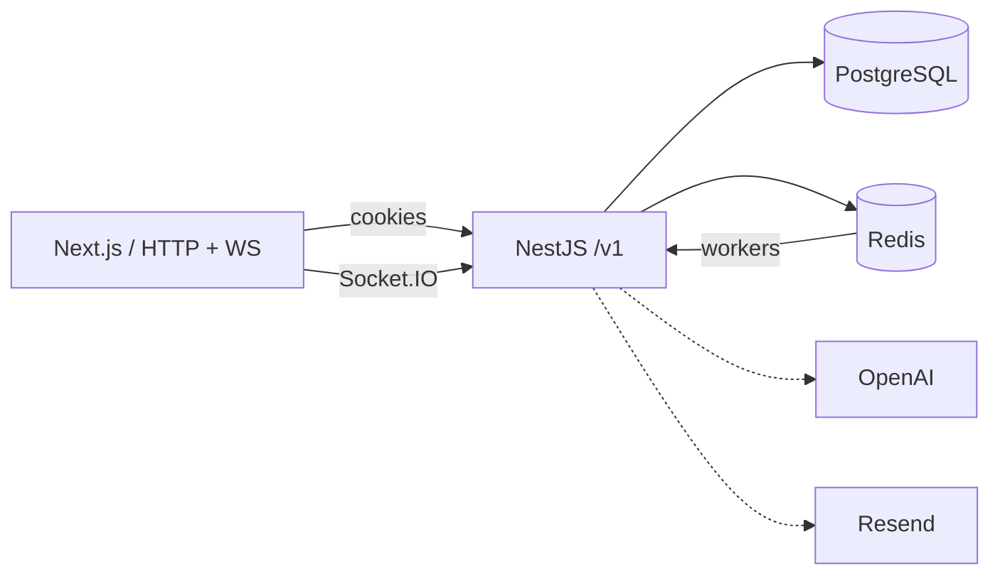
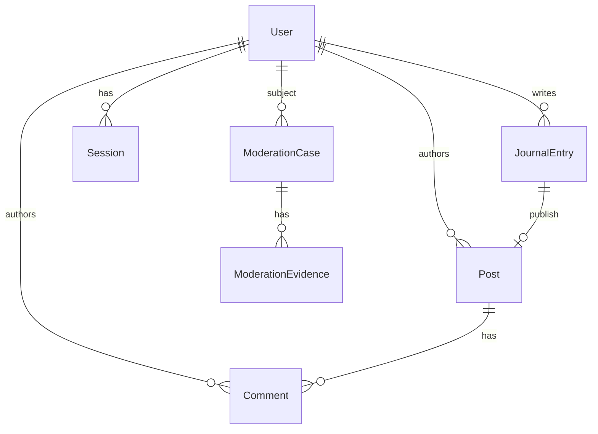
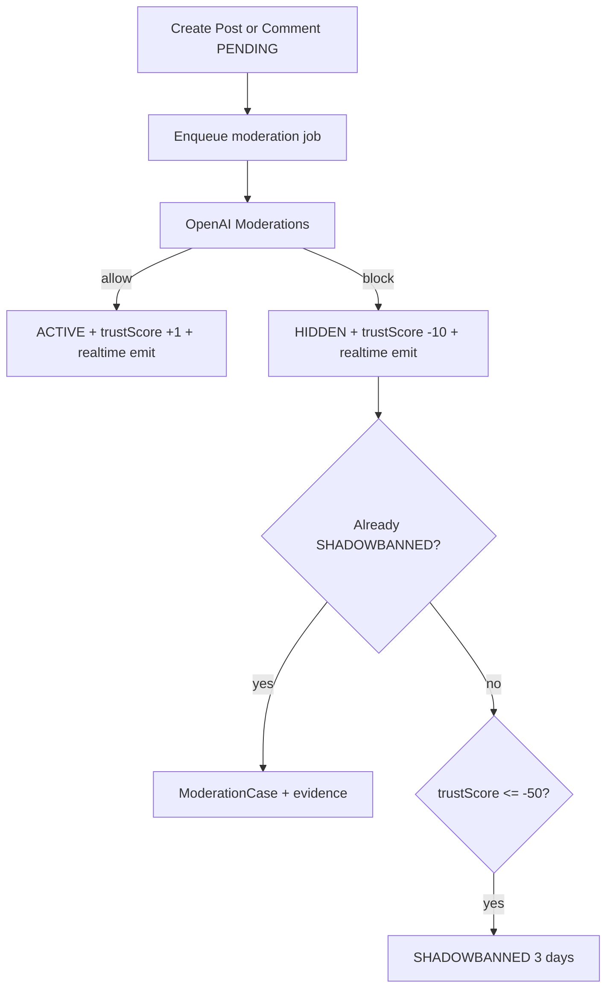
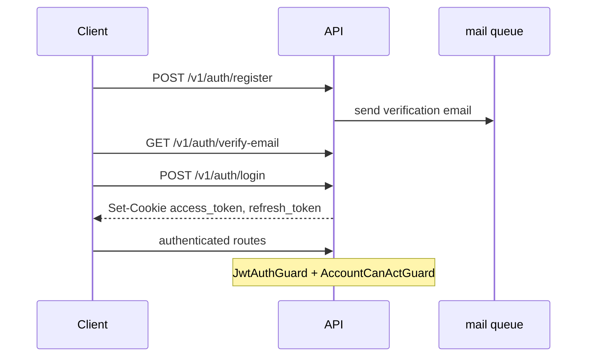

# Mental Journal API (`apps/api`)

NestJS REST + Socket.IO API for Mental Journal — private journal, public feed, comments, AI moderation, account profile, and auth.

Monorepo root docs: [`../../README.md`](../../README.md) · architecture notes: [`../../AGENT.md`](../../AGENT.md)

---

## Stack

| Piece      | Tech                                              |
| ---------- | ------------------------------------------------- |
| Runtime    | NestJS 11, TypeScript                             |
| DB         | PostgreSQL 16, Prisma 7                           |
| Queue      | Redis + BullMQ                                    |
| Realtime   | Socket.IO (`RealtimeGateway`)                     |
| Auth       | JWT in httpOnly cookies + hashed refresh sessions |
| Mail       | Resend (async `mail` queue)                       |
| Moderation | OpenAI Moderations (async `moderation` queue)     |
| Shared     | `@repo/api-types` (tags, error codes)             |

Global prefix: **`/v1`**. Swagger (non-production): **`/api`**.

---

## Architecture



**v1 style:** `controller → service → Prisma`. Ports/adapters only for external edges (auth use-cases, mail enqueue, OpenAI, realtime notify). HTTP responses are DTOs only.

### Modules

```
src/
  modules/
    auth/          register, login, verify, refresh, logout, logout-all, ws-token
    user/          profile update (anonName, password, avatar)
    session/       refresh sessions + adapters
    mail/          Resend + MailProcessor
    journal/       private entries + publish → Post
    feed/          public ACTIVE posts (tags filter)
    comment/       comments on ACTIVE posts
    moderation/    OpenAI service, ModerationProcessor, shadowban cron
    realtime/      Socket.IO gateway + notify adapters
    storage/       avatar upload helpers
    queue/         BullMQ registration + job consts
    health/
  common/          guards, exceptions, assert* helpers
  prisma/          PrismaService
  generated/       Prisma client (generated)
```

### Domain (simplified)



| Concept          | Behavior                                                                |
| ---------------- | ----------------------------------------------------------------------- |
| `JournalEntry`   | Private; owner-only CRUD                                                |
| `Post`           | Snapshot created on publish; `PENDING` → AI → `ACTIVE` / `HIDDEN`       |
| `Comment`        | Same moderation pipeline as posts                                       |
| `SHADOWBANNED`   | Can use journal; cannot publish/comment                                 |
| `ModerationCase` | Opened on AI block while already shadowbanned (for future human review) |

### Publish / comment moderation



Trust deltas: `+1` allow, `-10` block, threshold `-50`. Shadowban until midnight Europe/Warsaw (+3 calendar days). Cron: `SHADOWBAN_EXPIRY_CRON` / `SHADOWBAN_TIME_ZONE`.

### Auth



---

## HTTP surface

| Area     | Routes                                                                                     |
| -------- | ------------------------------------------------------------------------------------------ |
| Health   | `GET /v1/health`                                                                           |
| Auth     | `POST register`, `login`, `resend-verification`, `logout`, `logout-all`, `refresh`         |
| Auth     | `GET verify-email`, `me`, `ws-token`                                                       |
| Users    | `PATCH /v1/users/me` (multipart: anonName, password change, avatar)                        |
| Journal  | `GET/POST /v1/journal`, `GET/PATCH/DELETE /v1/journal/:id`, `POST /v1/journal/:id/publish` |
| Feed     | `GET /v1/feed` — cursor + optional `tags`                                                  |
| Comments | `POST /v1/comments`, `GET /v1/comments?postId=`, `DELETE /v1/comments/:id`                 |

### List query params

**Feed** (`GET /v1/feed`): `tags` (repeatable / array), `lastCursorId`, `lastCreatedAt`.

**Journal** (`GET /v1/journal`): `sortBy` (`date` \| `mood`), `orderBy` (`asc` \| `desc`), cursor fields `lastCursorId`, `lastCreatedAt`, `lastMood` (when sorting by mood).

### Realtime (Socket.IO)

Auth: JWT access token on the handshake (cookie or auth payload; web uses `GET /v1/auth/ws-token`).

| Event              | When                     |
| ------------------ | ------------------------ |
| `feed:new-post`    | Post becomes `ACTIVE`    |
| `feed:post-hidden` | Post becomes `HIDDEN`    |
| `comment:active`   | Comment becomes `ACTIVE` |
| `comment:hidden`   | Comment becomes `HIDDEN` |

---

## Local setup

From **repo root** (recommended):

```sh
pnpm install
cp apps/api/.env.example apps/api/.env   # fill values
pnpm docker:up                           # Postgres + Redis
pnpm db:migrate
pnpm --filter api dev
```

Or from this package:

```sh
pnpm install          # from root first
pnpm dev              # predev brings docker up + prisma generate
pnpm test
pnpm check-types
pnpm db:migrate
```

See `.env.example` for required keys (`DATABASE_URL`, `REDIS_URL`, `JWT_*`, `OPENAI_API_KEY`, `RESEND_*`, …).

| URL     |                           |
| ------- | ------------------------- |
| API     | http://localhost:3001/v1  |
| Swagger | http://localhost:3001/api |

---

## Scripts (package)

| Script                                 | Description                                       |
| -------------------------------------- | ------------------------------------------------- |
| `dev`                                  | Nest watch (`predev`: docker + `prisma generate`) |
| `build` / `start:prod`                 | Build / run `dist`                                |
| `test`                                 | Jest unit tests                                   |
| `check-types`                          | `tsc --noEmit`                                    |
| `db:migrate` / `db:push` / `db:studio` | Prisma                                            |

---

## Out of scope (this package)

- Frontend UI (see `apps/web`)
- Chat / DMs
- CMS endpoints to resolve `ModerationCase`
- Email-based password reset
